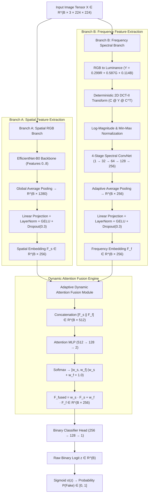

# Architectural Anatomy of LX-DFD Model

**Project**: LX-DFD — Generalizable Deepfake Detection Using Spatial-Frequency Feature Learning  
**Author**: Antigravity AI Pair Programmer  
**Date**: September 6, 2026  
**Document Version**: 1.0  
**Target Codebase**: `C:\Users\nandi\Desktop\DEEPFAKE DETECTION`

---

## Executive Summary

The **LX-DFD (Spatial-Frequency Dual-Branch Network)** is a lightweight (~4.89M parameters), generalizable deepfake image detection model designed to combat high-level spatial visual manipulation as well as subtle spectral frequency artifacts. By unifying an ImageNet-pretrained **Spatial RGB Branch** (Branch A) and a deterministic **2D Discrete Cosine Transform (DCT-II) Spectral Branch** (Branch B) via a **Dynamic Sample-Wise Attention Fusion Module**, LX-DFD achieves robust deepfake detection that generalizes across diverse GAN and Diffusion generators under real-world transformations (e.g., JPEG compression, Gaussian blur, scaling).

---

## 1. High-Level System Architecture

The model processes an input image tensor $x \in \mathbb{R}^{B \times 3 \times 224 \times 224}$ concurrently through two domain-specific processing branches. The resulting 256-dimensional feature embeddings $F_s$ and $F_f$ are combined by a dynamic attention network before passing to a binary classification head.

---

## 2. Detailed Branch Specifications

### 2.1 Branch A: Spatial RGB Branch (`SpatialBranch`)
- **Primary Function**: Captures spatial cues such as facial boundary anomalies, eye color mismatch, blending seams, and skin texture irregularities.
- **Source Code**: [`src/models/spatial_branch.py`](file:///C:/Users/nandi/Desktop/DEEPFAKE%20DETECTION/src/models/spatial_branch.py)

#### Architectural Pipeline:
1. **Backbone**: `EfficientNet-B0` initialized with ImageNet-pretrained weights.
   - Extracts feature maps through 9 MBConv blocks, producing a spatial tensor of size $(B, 1280, 7, 7)$.
2. **Global Average Pooling**:
   $$\text{GAP}(x) = \frac{1}{7 \times 7} \sum_{i=1}^7 \sum_{j=1}^7 x_{:, :, i, j} \quad \in \mathbb{R}^{B \times 1280}$$
3. **Linear Projection Head**:
   - `nn.Linear(1280, 256)`
   - `nn.LayerNorm(256)`
   - `nn.GELU()`
   - `nn.Dropout(p=0.3)`
4. **Output Representation**: Spatial embedding vector $F_s \in \mathbb{R}^{B \times 256}$.

---

### 2.2 Branch B: Frequency Spectral Branch (`FrequencyBranch`)
- **Primary Function**: Isolates high-frequency spectral artifacts, periodic grid noise, and upsampling traces produced by generative models (GANs, Diffusion Models).
- **Source Code**: [`src/models/frequency_branch.py`](file:///C:/Users/nandi/Desktop/DEEPFAKE%20DETECTION/src/models/frequency_branch.py) & [`src/frequency/dct.py`](file:///C:/Users/nandi/Desktop/DEEPFAKE%20DETECTION/src/frequency/dct.py)

#### Step B.1: Deterministic 2D Discrete Cosine Transform (DCT-II)
- Converts input image $x \in \mathbb{R}^{B \times 3 \times 224 \times 224}$ into single-channel luminance:
  $$Y = 0.299 \cdot R + 0.587 \cdot G + 0.114 \cdot B \quad \in \mathbb{R}^{B \times 1 \times 224 \times 224}$$
- Computes orthogonal $N \times N$ DCT-II transformation matrix $C \in \mathbb{R}^{224 \times 224}$ registered as a non-trainable GPU buffer:
  $$C_{i, j} = \begin{cases} \sqrt{\frac{1}{N}} & \text{if } i = 0 \\ \sqrt{\frac{2}{N}} \cos\left( \frac{\pi (2j + 1) i}{2N} \right) & \text{if } i > 0 \end{cases}$$
- Computes 2D DCT via matrix multiplication:
  $$\text{DCT}(Y) = C \cdot Y \cdot C^T \quad \in \mathbb{R}^{B \times 1 \times 224 \times 224}$$
- Applies Log-Magnitude scaling & Min-Max normalization per sample:
  $$S = \log(1 + |\text{DCT}(Y)| + 10^{-6})$$
  $$\bar{S} = \frac{S - \min(S)}{\max(S) - \min(S) + 10^{-6}} \quad \in [0, 1]$$

#### Step B.2: 4-Stage Spectral ConvNet Encoder
Processes normalized spectral map $\bar{S}$ through 4 progressive stride-2 convolution blocks:

| Stage | Input Resolution | Output Resolution | Kernel / Stride / Pad | Out Channels | Activation / Normalization |
|---|---|---|---|---|---|
| **Conv 1** | $224 \times 224$ | $112 \times 112$ | $5 \times 5, s=2, p=2$ | 32 | `BatchNorm2d` + `ReLU` |
| **Conv 2** | $112 \times 112$ | $56 \times 56$ | $3 \times 3, s=2, p=1$ | 64 | `BatchNorm2d` + `ReLU` |
| **Conv 3** | $56 \times 56$ | $28 \times 28$ | $3 \times 3, s=2, p=1$ | 128 | `BatchNorm2d` + `ReLU` |
| **Conv 4** | $28 \times 28$ | $14 \times 14$ | $3 \times 3, s=2, p=1$ | 256 | `BatchNorm2d` + `ReLU` |
| **Pool** | $14 \times 14$ | $1 \times 1$ | Adaptive Avg Pool | 256 | Flatten to $\mathbb{R}^{B \times 256}$ |

- **Linear Projection Head**:
  $$\text{Linear}(256 \to 256) \longrightarrow \text{LayerNorm}(256) \longrightarrow \text{GELU}() \longrightarrow \text{Dropout}(p=0.3)$$
- **Output Representation**: Frequency embedding vector $F_f \in \mathbb{R}^{B \times 256}$.

---

### 2.3 Adaptive Spatial-Frequency Attention Fusion (`SpatialFrequencyFusion`)
- **Primary Function**: Dynamically assigns sample-specific weights $w_s$ and $w_f$ based on input degradation and domain signal strength.
- **Source Code**: [`src/models/fusion.py`](file:///C:/Users/nandi/Desktop/DEEPFAKE%20DETECTION/src/models/fusion.py)

#### Mathematical Formulation:
1. **Concatenate Embeddings**:
   $$F_{\text{concat}} = [F_s \parallel F_f] \in \mathbb{R}^{B \times 512}$$
2. **Compute Unnormalized Attention Logits**:
   $$a = \mathbf{W}_2 \cdot \text{ReLU}(\mathbf{W}_1 \cdot F_{\text{concat}} + \mathbf{b}_1) + \mathbf{b}_2 \quad \in \mathbb{R}^{B \times 2}$$
   where $\mathbf{W}_1 \in \mathbb{R}^{128 \times 512}$ and $\mathbf{W}_2 \in \mathbb{R}^{2 \times 128}$.
3. **Softmax Weighting**:
   $$[w_s, w_f] = \text{Softmax}(a, \text{dim}=1) \quad \implies w_s + w_f = 1.0$$
4. **Weighted Convex Fusion**:
   $$F_{\text{fused}} = w_s \cdot F_s + w_f \cdot F_f \in \mathbb{R}^{B \times 256}$$

---

### 2.4 Binary Classification Head (`classifier`)
- **Source Code**: [`src/models/lxfd_model.py`](file:///C:/Users/nandi/Desktop/DEEPFAKE%20DETECTION/src/models/lxfd_model.py#L30-L38)

#### Layer Architecture:
$$\text{Linear}(256 \to 128) \longrightarrow \text{GELU}() \longrightarrow \text{Dropout}(p=0.3) \longrightarrow \text{Linear}(128 \to 1)$$

- **Outputs**:
  - Raw binary logit $z \in \mathbb{R}^B$ (compatible with `torch.nn.BCEWithLogitsLoss`)
  - Prediction probability $\hat{y} = \sigma(z) = \frac{1}{1 + e^{-z}} \in [0, 1]$

---

## 3. Parameter Count & Dimensionality Breakdown

| Component | Layer / Module | Input Shape | Output Shape | Parameters |
|---|---|---|---|---|
| **Branch A (Spatial)** | EfficientNet-B0 Features | $(B, 3, 224, 224)$ | $(B, 1280, 7, 7)$ | 4,007,548 |
| | Global Average Pool | $(B, 1280, 7, 7)$ | $(B, 1280)$ | 0 |
| | Projection Layer (Linear + LN) | $(B, 1280)$ | $(B, 256)$ | 328,192 |
| **Branch B (Frequency)** | 2D DCT-II Transform Layer | $(B, 3, 224, 224)$ | $(B, 1, 224, 224)$ | 0 *(fixed buffer)* |
| | Conv Stage 1 + BN | $(B, 1, 224, 224)$ | $(B, 32, 112, 112)$ | 864 |
| | Conv Stage 2 + BN | $(B, 32, 112, 112)$ | $(B, 64, 56, 56)$ | 18,560 |
| | Conv Stage 3 + BN | $(B, 64, 56, 56)$ | $(B, 128, 28, 28)$ | 74,048 |
| | Conv Stage 4 + BN | $(B, 128, 28, 28)$ | $(B, 256, 14, 14)$ | 295,424 |
| | Adaptive Avg Pool | $(B, 256, 14, 14)$ | $(B, 256)$ | 0 |
| | Projection Layer (Linear + LN) | $(B, 256)$ | $(B, 256)$ | 66,048 |
| **Attention Fusion** | Attention MLP FC1 | $(B, 512)$ | $(B, 128)$ | 65,664 |
| | Attention MLP FC2 | $(B, 128)$ | $(B, 2)$ | 258 |
| **Classifier Head** | Dense Layer 1 | $(B, 256)$ | $(B, 128)$ | 32,896 |
| | Dense Layer 2 (Logit) | $(B, 128)$ | $(B, 1)$ | 129 |
| **TOTAL MODEL** | **LX-DFD Architecture** | $(B, 3, 224, 224)$ | $(B, 1)$ | **4,889,631** (~4.89 M) |

---

## 4. Key Strengths & Generalization Rationale

1. **Dual-Domain Synergy**: While spatial models fail under heavy compression or blur due to smoothed RGB boundaries, high-frequency DCT patterns remain detectable in Branch B.
2. **Dynamic Sample-Wise Attention**: When an image is uncompressed, Branch A receives higher attention ($w_s > w_f$). When an image undergoes JPEG compression or blur, Branch B's spectral signals receive higher weight ($w_f > w_s$).
3. **Compact Parameter Footprint**: At **~4.89M parameters**, LX-DFD achieves fast training convergence, real-time inference speeds (>100 FPS on modern GPUs), and strong resistance to overfitting.
